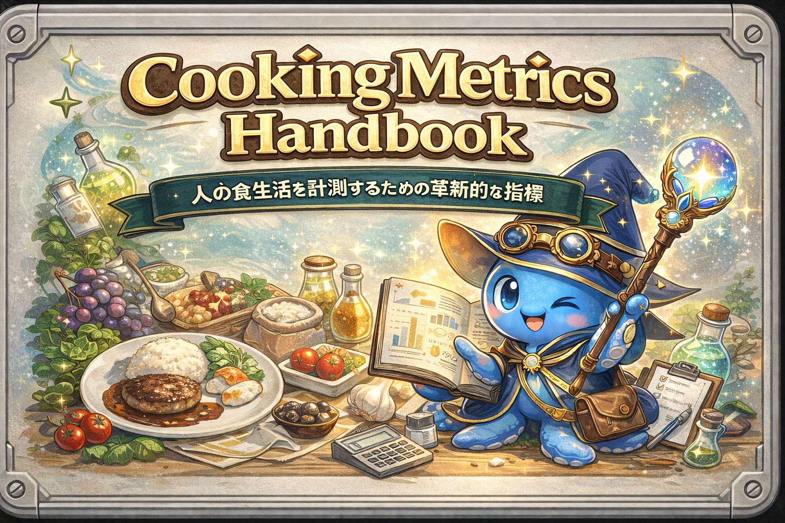
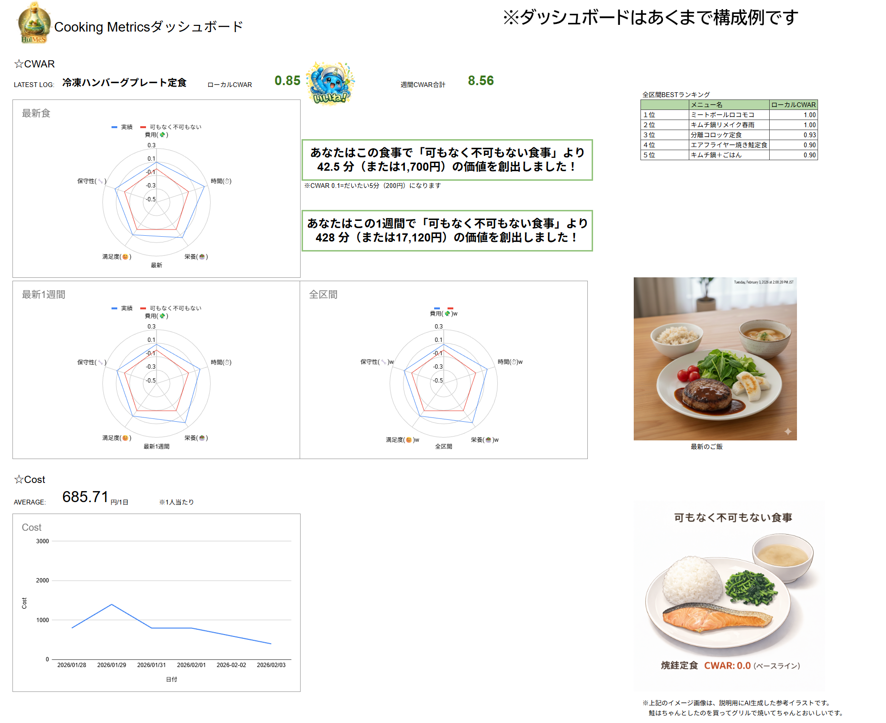

  

# CookingMetricsHandbook# 
> **「神がいない日」を機嫌よく生き抜くための、食生活最適化メトリクス**

## 🌟 プロジェクト概要
Cooking Metricsは「料理のうまさ」ではなく、その食事が生活全体にどれだけ貢献したかを数値化する指標群です。  
節約・我慢ではなく、無駄な摩擦を減らしてQOLを上げるための「生活OS」として設計されています。

### 核心概念：CWAR（シーウォー）
費用がまあまあ、消費時間もまあまあ、満足度もまあまあの  
「可もなく不可もない食事（焼き鮭定食等）」を基準点（0.0）とし、あなたの選択がどれだけ生活の質を上げたかを可視化します。

0.0 = 可もなく不可もない食事と変わらない  
マイナス = 可もなく不可もない食事にした方が生活の質が上がった　⇒　負け飯  
プラス = 可もなく不可もない食事より生活の質が上がった　⇒　勝ち飯

超絶おいしくても、時間がかかりすぎたり、後片付けが辛かったり、栄養バランスが悪いものは、負け飯になることがあります。

その食事が生活全体にどれだけ貢献したかを数値化することで、分析や改善が容易になります。  
ざっくり計算で大丈夫です！AIにやってもらいましょう。

これは点数で自分を評価・断罪するためのものではなく、  
生活を少しずつ楽にするための  
「可視化・改善ツール」です。  

世の中の神レシピは、毎日『神』が降臨することを前提に書かれています。  
でも、現実は違います。  
仕事に疲れ、洗い物に絶望し、神が不在の日がほとんどです。  
だからこそ、『神がいない日』をどう機嫌よく生き抜くかのための指標なのです。  

採点の仕方はハンドブックを、
事例は事例集を参照ください。

### 評価事例

シンプルなレーダーチャートで1食を多軸評価。ぱっと見で凹凸が分かる。

### ダッシュボード構成例

